# OMS 项目整体运行逻辑

## 1. 总体架构

项目由四个主要工程组成：

- `omsapi`：Spring Boot 后端，负责登录认证、权限、业务接口、数据库读写、导入导出、外部接口和设备命令。
- `omsvue`：Vue 2 前端，负责登录页、动态菜单、业务页面、接口调用、消息提醒和开发代理。
- `jxjcmiddleware`：Spring Boot 数据采集中间件，负责 IoT 平台订阅、平台回调接收、RocketMQ 缓冲、NB 原始报文解析、表具数据入库和待下发命令轮询。
- `litejxdemo_juzhen`：华为 IoT 平台 Java 示例/原型工程，包含认证、设备查询、历史数据查询、订阅通知、命令下发、回调服务和 MyBatis 入库示例。

开发环境默认访问链路：

```text
浏览器 http://localhost:10001
  -> omsvue webpack-dev-server
  -> proxyTable 代理 API 到 http://127.0.0.1:7077
  -> omsapi Spring Boot
  -> MyBatis Mapper XML
  -> MySQL
```

采集环境默认链路：

```text
NB/IoT 设备
  -> 华为/电信 IoT 平台
  -> jxjcmiddleware 回调端口 8800
  -> RocketMQ Topic JXJC
  -> ResHandles 解析原始报文
  -> ecu / ecu_history / model_control / model_control_history / nb_device
  -> omsapi 查询展示
  -> omsvue 页面展示
```

### 四工程关系图

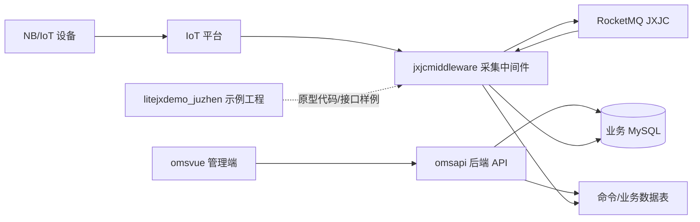

## 2. 启动逻辑

后端 `omsapi/start.sh`：

- 优先使用 JDK 8，避免老版本 Lombok 在高版本 JDK 下编译失败。
- 默认启用 `server_dev` 配置。
- 使用 Maven 启动 Spring Boot。
- 后端入口是 `com.newsun.MsApiApplication`。

前端 `omsvue/start.sh`：

- 加载本机 `nvm`。
- 默认使用 Node 20。
- Node 17+ 自动追加 `--openssl-legacy-provider`。
- 默认把接口代理到 `http://127.0.0.1:7077`。
- 启动 `webpack-dev-server`，访问地址为 `http://localhost:10001`。

### 启动流程图

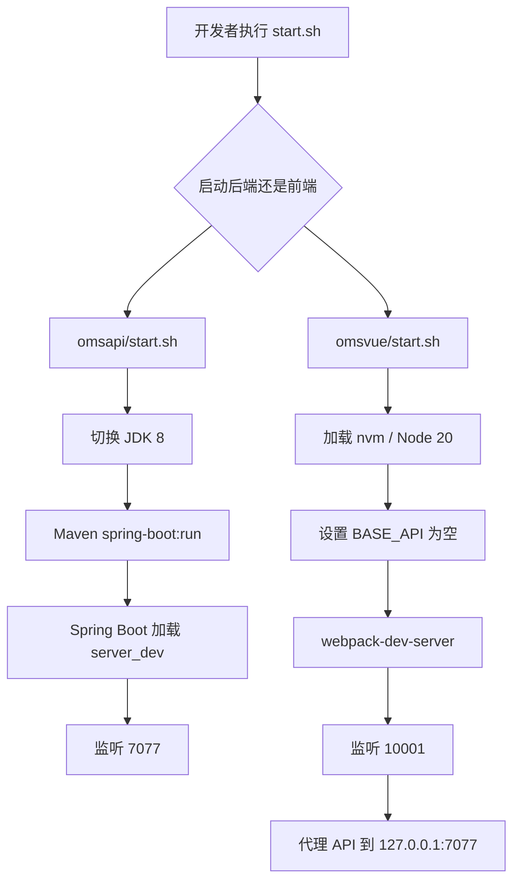

## 3. 前端运行逻辑

前端入口是 `src/main.js`：

- 注册 Element UI、axios 请求方法、过滤器、图片预览、moment 等全局能力。
- 初始化 Vue Router 和 Vuex Store。
- 通过 `router.beforeEach` 控制页面访问。
- 未登录访问受保护页面时跳转登录页。
- 登录后调用 `initMenu(router, store)` 拉取后端菜单并动态挂载路由。

静态路由只有：

- `/`：登录页。
- `/home`：主页。
- `/chat`：消息页。

业务菜单来自后端 `/config/sysmenu`，前端根据菜单里的 `component` 前缀动态加载组件：

- `Doc*` -> `documentmanage`
- `Bh*` -> `binghuaManage`
- `Busi*` -> `businessManage`
- `Met*` -> `meterReading`
- `Sta*` -> `statistics`
- `Sys*` -> `system`
- `Rep*` -> `repeaters`
- `Abn*` -> `abnormal`
- `NB*` -> `nbControl`
- `Check*` -> `chabiaoke`

### 前端页面流程图

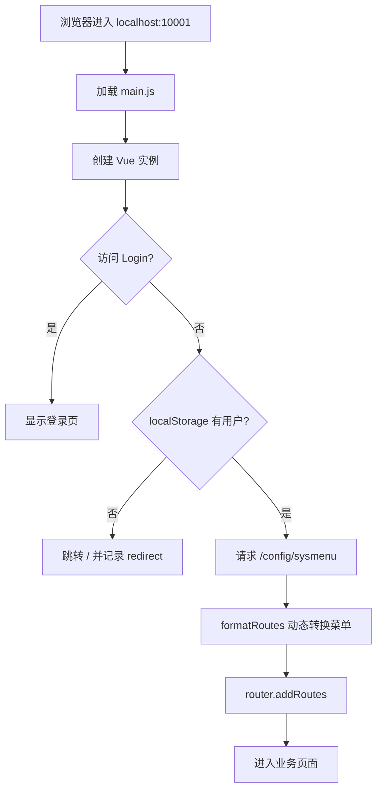

## 4. 登录与会话逻辑

登录入口：

- 前端登录页调用 `postRequest('/login')`。
- 开发环境下 `/login` 会被 webpack 代理到后端。
- 后端 Spring Security 使用 `formLogin().loginProcessingUrl("/login")` 处理登录。
- 用户信息由 `SysOperaterService.loadUserByUsername` 从数据库读取。
- 密码使用 BCrypt 校验。
- 登录成功后返回 JSON：`status=success` 和当前用户信息。
- 前端把用户写入 Vuex 和 `localStorage`。
- 登录后跳转 `/home` 或原始 redirect 页面。

登录失败：

- 用户名或密码错误时返回 JSON 错误信息。
- 后端会累加 `sys_operator.fail_num`。
- 账户禁用时返回账户禁用提示。

### 登录流程图

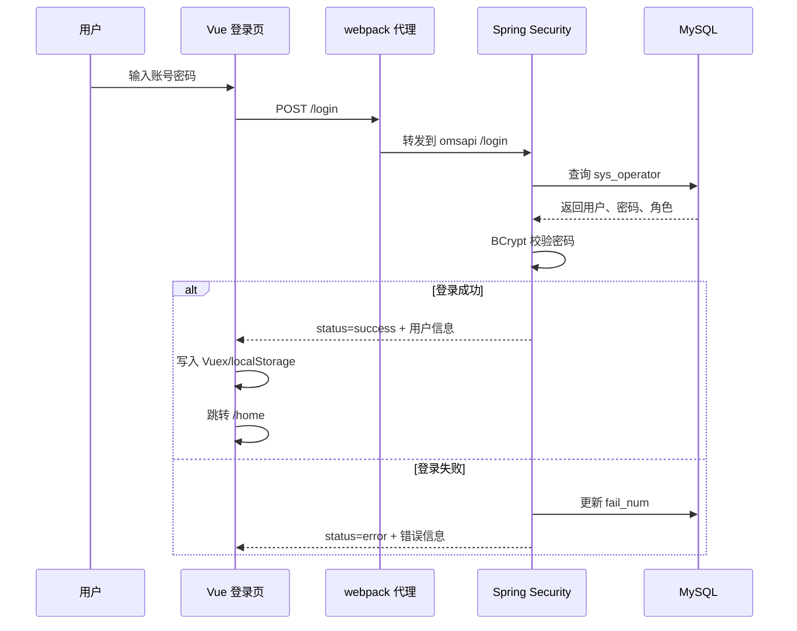

## 5. 权限与菜单逻辑

后端安全入口在 `WebSecurityConfig`：

- 静态资源和 `/login_p` 直接放行。
- 部分公开接口通过 `permitAll()` 放行。
- 其他接口进入自定义权限链。

自定义权限入口：

- `UrlFilterInvocationSecurityMetadataSource` 获取当前请求地址。
- 公开接口返回 `null`，表示不需要角色。
- 其他接口默认返回 `ROLE_LOGIN`，表示至少需要登录。
- `UrlAccessDecisionManager` 做最终访问决策。
- 权限不足时由 `AuthenticationAccessDeniedHandler` 返回拒绝结果。

菜单逻辑：

- 前端请求 `/config/sysmenu`。
- 后端按当前登录用户和菜单表返回可访问菜单。
- 前端把菜单转换成 Vue Router 动态路由。

### 权限流程图

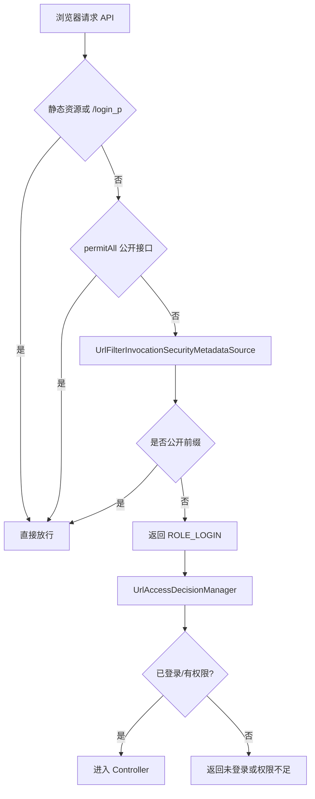

## 6. 后端业务调用链

后端大部分接口遵循固定分层：

```text
Controller
  -> Service
  -> Mapper 接口
  -> resources/META-INF/mapper/*.xml
  -> MySQL
```

典型职责：

- `controller`：接收 HTTP 请求、参数绑定、返回结果。
- `service`：业务计算、校验、跨表处理、导入导出、调用外部服务。
- `mapper`：MyBatis 数据访问接口。
- `mapper XML`：SQL 查询、分页、增删改查。
- `bean/pojo`：实体、DTO、VO、查询参数。

### 后端调用流程图

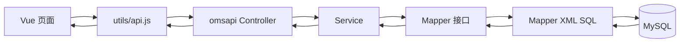

## 7. 核心业务模块

### 档案与用户

前端模块：

- `documentmanage`
- `businessManage`

后端接口：

- `/userProfiles`
- `/meter`
- `/newsunMeter/exchange`
- `/newsun/updateAlter`
- `/wechart/transferinfo`

主要流程：

- 建档、修改档案、绑定水表。
- 表具变更、换表、过户、销户。
- 业务操作中常读取当前操作员信息并落库。

### 收费与账户

前端模块：

- `businessManage`
- `binghuaManage`
- `statistics`

后端接口：

- `/newsun/payment`
- `/mechanicalMeter`
- `/bhBusiCharges`
- `/loadCharges`
- `/countsum`
- `/chartsum`

主要流程：

- 查询用户/水表。
- 计算费用或阶梯价格。
- 写入缴费记录、账户流水、打印次数等。
- 支持 IC/机械表/冰花卡等多类型收费。

### 抄表与设备控制

前端模块：

- `meterReading`
- `nbControl`
- `repeaters`
- `chabiaoke`

后端接口：

- `/meter/reading`
- `/nb/port`
- `/nb/commNBOnenet`
- `/newsun/order`
- `/checkMission`
- `/checkSubmission`

主要流程：

- 查询表具读数、命令记录。
- 下发阀控、读表、开关阀等命令。
- 管理查表任务、提交记录和异常数据。

### 系统基础配置

前端模块：

- `system`

后端接口：

- `/system/user`
- `/system/basic`
- `/system/code`
- `/system/price`
- `/system/price/detail`
- `/basic`

主要流程：

- 操作员、角色、菜单、组织、地址管理。
- 基础编码、价格、阶梯价配置。

### 微信、发票、外部接口

后端接口：

- `/wechart`
- `/wechart/invoice`
- `/wechart/invoiceinfo`
- `/wechart/invoiceTitle`
- `/wechart/resource`
- `/Alipay`
- `/thirdlog`

主要流程：

- 微信用户绑定、查询缴费、上传附件。
- 发票抬头、开票、邮件发送、PDF/资源下载。
- 外部支付、银行、第三方日志接口。

## 8. 通用接口请求逻辑

前端 `src/utils/api.js` 封装了：

- `getRequest`
- `postRequest`
- `putRequest`
- `putJsonRequest`
- `deleteRequest`
- `uploadFileRequest`
- `downLoadPostRequest`

请求特点：

- 普通 POST/PUT 默认使用 `application/x-www-form-urlencoded`。
- JSON PUT 使用 `application/json;charset=UTF-8`。
- 下载接口使用 `blob`。
- 响应中 `status=error` 时前端直接弹出后端错误信息。
- 403 显示权限不足。
- 无响应时提示后端服务未启动或连接失败。

### 请求流程图

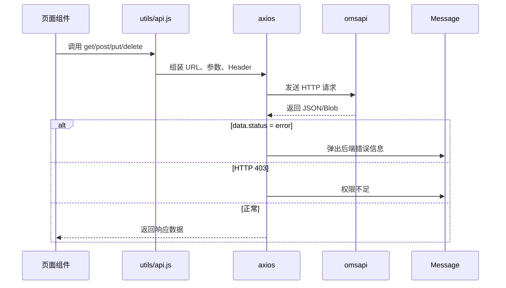

## 9. 消息逻辑

前端 Store 中保留 SockJS/STOMP 客户端：

- 登录成功后调用 `connect()`。
- 连接 `/ws/endpointChat`。
- 订阅 `/user/queue/chat` 保存聊天消息到 `localStorage`。
- 订阅 `/topic/nf` 设置通知红点。

当前代码中未看到后端 WebSocket 配置类，若消息功能要完整运行，需要确认运行环境里是否存在额外 WebSocket 配置或旧分支代码。

### 消息流程图

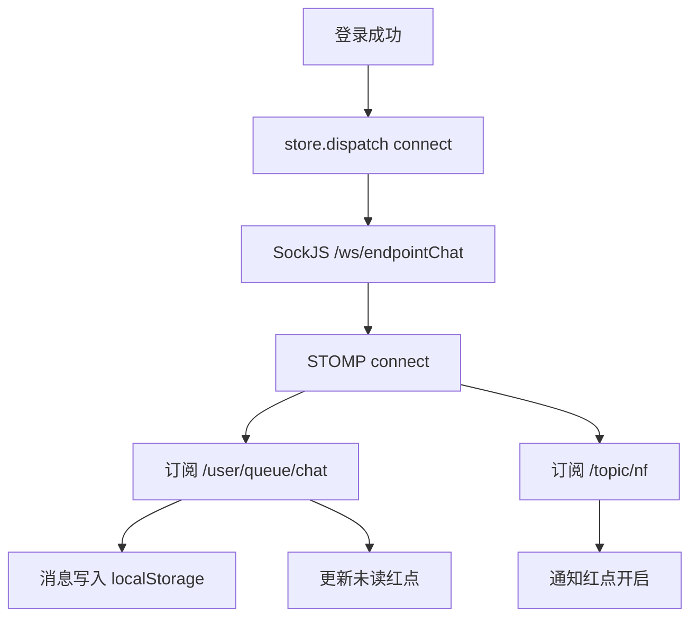

## 10. 生产构建与部署逻辑

前端：

- `npm run build` 输出到 `omsvue/dist`。
- 构建后的静态资源需要部署到 Web 服务器或后端静态资源位置。
- 生产环境接口地址由 `BASE_API` 和部署代理决定。

后端：

- Maven 打包生成 Spring Boot 应用。
- 运行时根据 profile 加载对应 `application-*.properties`。
- 需要同步本地 jar、模板、PDF/Word 资源和外部配置。

### 部署流程图

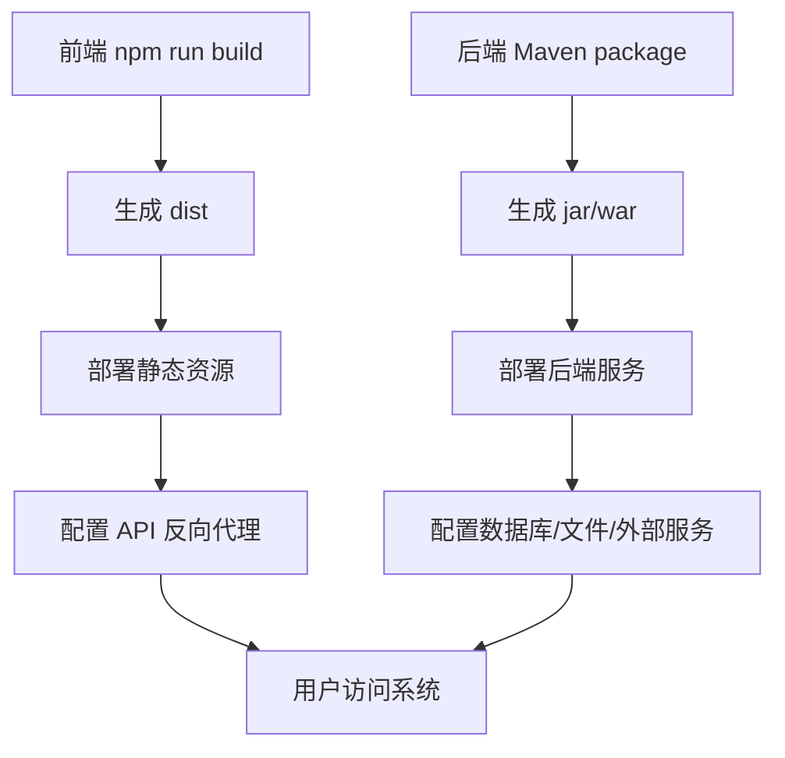

## 11. 排查入口

常见问题优先检查：

- 前端白屏：浏览器 Console、`npm run dev` 编译输出、动态菜单组件路径。
- 登录失败：`/login` 响应、`sys_operator` 用户状态、密码 BCrypt、`fail_num` 字段。
- 接口 302/CORS：确认前端是否走 webpack 代理，`BASE_API` 是否为空。
- 权限不足：菜单表、角色关系、Spring Security 放行规则。
- 数据异常：对应 Controller -> Service -> Mapper XML 的 SQL。
- 构建失败：JDK 版本、Node 版本、PostCSS 配置、本地 jar 是否存在。

## 12. 数据采集中间件 `jxjcmiddleware`

`jxjcmiddleware` 是当前项目的数据采集核心，入口类是：

```text
com.onenet.JXJCmiddleware.SubscribeNotification
```

启动后主要做三件事：

- 启动本地回调 HTTP 服务，默认端口 `8800`。
- 使用双向 SSL 登录 IoT 平台，获取 `accessToken`。
- 向 IoT 平台订阅 `deviceDataChanged` 通知。

工程使用 Spring Boot + MyBatis + RocketMQ：

- `SimpleHttpServer`：接收 IoT 平台推送的 HTTP 回调。
- `MQProducerConfiguration`：创建 RocketMQ Producer。
- `MQConsumerConfiguration`：创建 RocketMQ Consumer。
- `MQConsumeMsgListenerProcessor`：消费 `JXJC~JXJCTag` 消息。
- `ResHandles`：处理平台推送 JSON。
- `StorageEcuHandles`：解析 NB 原始报文并入库。
- `CommandTask`：每分钟扫描待下发命令。
- `PostAsynCommand`：调用 IoT 平台异步命令接口。

### 采集入库流程

1. IoT 平台推送 `deviceDataChanged` 到中间件回调地址。
2. `SimpleHttpServer` 从 HTTP body 中取出 JSON。
3. 中间件把 JSON 发送到 RocketMQ：Topic `JXJC`，Tag `JXJCTag`。
4. Consumer 收到消息后调用 `ResHandles.resHandleByData`。
5. `ResHandles` 解析 `notifyType/deviceId/gatewayId/service/data.d1`。
6. `DBDevice.addByDevice` 把原始协议写入 `nb_device`。
7. `StorageEcuHandles.StorageEcu` 解析 `d1` 十六进制报文。
8. 根据表号写入或更新：
   - `ecu`
   - `ecu_history`
   - `model_control`
   - `model_control_history`

### 采集入库流程图

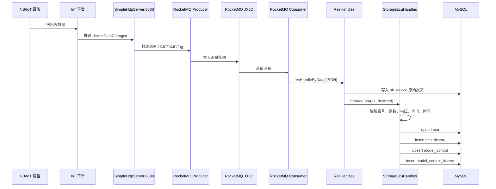

### 原始报文解析要点

`StorageEcuHandles` 当前按固定位置截取报文：

- `preString`：前 62 位，含 IMEI、协议版本、信号、覆盖等级、数据长度等。
- `cenString`：中间数据域，当前按明文处理。
- `sufString`：末尾 8 位，含指令 MID 和校验码。

主要解析结果：

- 表号：`ecuid`
- 累计流量：`reading`
- 电池电压：`voltage`
- 采集时间：`mTime`
- 阀门状态：`valveStatus`
- 平台设备 ID：`deviceId`

这些数据最终服务于 `omsapi` 中的抄表、NB 控制、表具档案和统计查询。

## 13. 命令下发逻辑

命令下发由 `jxjcmiddleware` 定时执行：

- `CommandTask.timeTask()` 每分钟触发一次。
- `PostAsynCommand.CommandTask02()` 查询 `nb_deviceorder where sign = '0'`。
- 每条待下发命令包含 `deviceId/serviceId/method/param`。
- 中间件登录 IoT 平台获取 token。
- 调用平台异步命令接口 `POST_ASYN_CMD`。
- 下发后把 `nb_deviceorder.sign` 改为 `1`。
- 同时插入 `nb_deviceorder_history`。

### 命令下发流程图

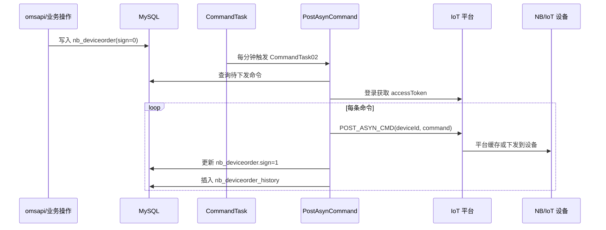

## 14. `litejxdemo_juzhen` 示例工程

`litejxdemo_juzhen` 不是 Spring Boot 服务，更像华为 IoT 接口原型/验证工程。它保留了中间件早期或参考实现：

- `appAccessSecurity`：平台认证、刷新 token。
- `dataCollection`：查询设备、设备能力、当前数据、历史数据、订阅通知。
- `deviceManagement`：注册、删除、修改、发现设备。
- `signalingDelivery`：异步命令下发、命令查询、取消任务。
- `messagePushing` / `testMessagePush`：本地 HTTP 回调接收和订阅测试。
- `handleRes`：平台推送数据解析。
- `DB` / `mapper`：MyBatis 入库示例。

它和 `jxjcmiddleware` 的关系：

- `litejxdemo_juzhen` 提供华为平台接口调用样例。
- `jxjcmiddleware` 把这些能力服务化，并增加 Spring Boot、RocketMQ、定时任务和正式入库流程。
- 当前生产/开发联动更应以 `jxjcmiddleware` 为准。

### 示例工程能力图

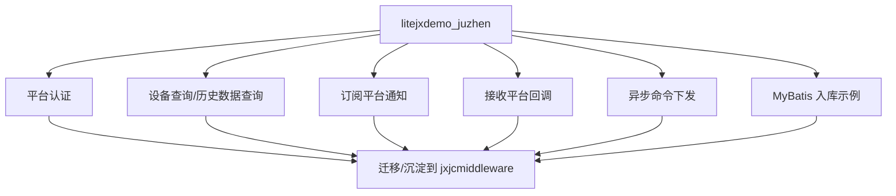

## 15. 完整业务闭环

完整闭环可以理解为两条线：

- 管理线：`omsvue -> omsapi -> MySQL`
- 采集线：`设备 -> IoT 平台 -> jxjcmiddleware -> RocketMQ -> MySQL -> omsapi -> omsvue`

命令下发把两条线连起来：

- 管理端发起阀控/读表/命令。
- 后端写入命令表。
- 中间件定时读取命令表并下发到 IoT 平台。
- 设备执行后重新上报数据。
- 中间件解析入库。
- 管理端查询到最新状态。

### 完整闭环流程图

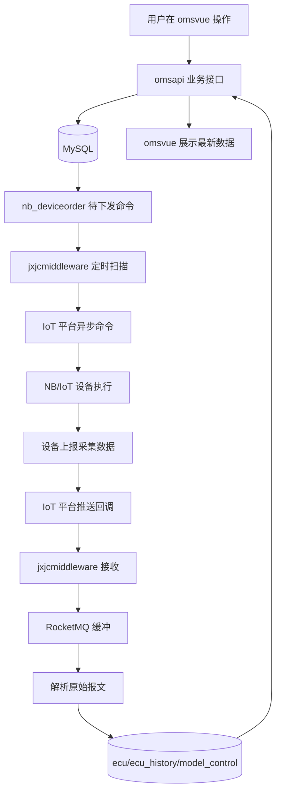
